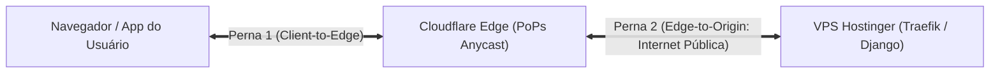

# 🔐 Análise Comparativa dos Modos SSL/TLS da Cloudflare & A Falácia do Modo Flexible
**Projeto:** Estudo de Arquitetura de Sistemas Inteligentes (Padrão PycoderBR / SCSI)  
**Módulo:** Fase 3 — Borda, Domínio & Criptografia (Passo 4: SSL/TLS)  
**Sub-etapa:** 3.3.1 — Análise Criptográfica dos Modos SSL/TLS e Mitigação de Vulnerabilidades  
**Data de Emissão:** 21/09/2026  
**Status:** **Homologado para Engenharia de Produção**

---

## 1. O Papel da Criptografia em Borda na Arquitetura SCSI

Em sistemas distribuídos corporativos que manipulam apólices de seguros, dados financeiros e comunicação com agentes de inteligência artificial, o transporte seguro de dados não pode depender de suposições. 

A Cloudflare atua como um intermediário reverso (*Reverse Proxy*). Isso significa que a comunicação entre o cliente final e o servidor na VPS Hostinger é composta por **duas pernas de conexão independentes**:
1. **Perna Externa (Client-to-Edge):** Entre o navegador/app do usuário e os PoPs Anycast da Cloudflare.
2. **Perna Interna (Edge-to-Origin):** Entre os servidores da Cloudflare e o Traefik Ingress na porta 443 da VPS Hostinger, trafegando pela internet pública através de múltiplos backbones e provedores de trânsito (ISPs).



A escolha do modo SSL/TLS da Cloudflare determina se a **Perna 2** trafega criptografada e autenticada ou exposta em texto plano.

---

## 2. Análise Comparativa dos 4 Modos SSL/TLS da Cloudflare

```mermaid
flowchart TD
    subgraph MODO_OFF["Modo 1: OFF (Inadmissível)"]
        direction LR
        C1["Cliente"] ---|HTTP Texto Claro| E1["Cloudflare"] ---|HTTP Texto Claro| O1["VPS Hostinger"]
    end

    subgraph MODO_FLEXIBLE["Modo 2: FLEXIBLE (Anti-Padrão Crítico / Falsa Segurança)"]
        direction LR
        C2["Cliente"] ===|HTTPS Criptografado (443)| E2["Cloudflare"] ---|HTTP Texto Claro (80)| O2["VPS Hostinger"]
    end

    subgraph MODO_FULL["Modo 3: FULL (Criptografado mas Não-Autenticado)"]
        direction LR
        C3["Cliente"] ===|HTTPS (443)| E3["Cloudflare"] ===|HTTPS Sem Validação de CA (443)| O3["VPS Hostinger"]
    end

    subgraph MODO_FULL_STRICT["Modo 4: FULL (STRICT) — Padrão Corporativo SCSI"]
        direction LR
        C4["Cliente"] ===|HTTPS TLS 1.3 (443)| E4["Cloudflare"] ===|HTTPS com Validação Estrita de CA (443)| O4["VPS Hostinger"]
    end
```

### Matriz Comparativa de Engenharia:

| Modo | Perna 1 (Client-to-Edge) | Perna 2 (Edge-to-Origin) | Validação da CA de Origem | Risco MitM na Origem | Veredito SCSI |
| :--- | :---: | :---: | :---: | :---: | :--- |
| **Off** | HTTP (Texto claro) | HTTP (Texto claro) | Nenhuma | **Crítico (100%)** | ❌ **Proibido.** Sem criptografia. |
| **Flexible** | HTTPS (Criptografado) | HTTP (Texto claro) | Nenhuma | **Crítico (100%)** | ❌ **Proibido (Anti-Padrão).** Falsa sensação de segurança. |
| **Full** | HTTPS (Criptografado) | HTTPS (Criptografado) | Nenhuma (aceita autoassinado) | **Médio** (vulnerável a spoofing de DNS/BGP) | ⚠️ **Não Recomendado.** Sem validação de identidade. |
| **Full (Strict)** | HTTPS (TLS 1.3) | HTTPS (TLS 1.3) | **Estrita (Cloudflare Origin CA)** | **Zero** (Mitigado com autenticação mútua) | ✅ **Mandatório (ADR 010).** Padrão Ouro SCSI. |

---

## 3. A Desconstrução Técnica da "Falácia do Modo Flexible"

O modo **Flexible** é uma armadilha comum em projetos web amadores. A Cloudflare exibe o cadeado de segurança verde no navegador do usuário, mas encaminha todos os dados em **HTTP puro na porta 80** para a VPS através da internet.

### As 4 Falhas Críticas do Modo Flexible:

#### 1. Vulnerabilidade a Ataques Man-in-the-Middle (MitM)
No trânsito entre os datacenters da Cloudflare e o data center da Hostinger na Europa/América, os pacotes trafegam por dezenas de roteadores e operadoras de telecomunicação. Qualquer ator com capacidade de escuta no trânsito (provedores desonestos, atacantes com envenenamento ARP/BGP ou agências de vigilância) pode interceptar senhas, tokens de autenticação JWT, cookies de sessão e dados de apólices em **texto plano legível**.

#### 2. O Erro Clássico do "Redirect Loop 301" (Too Many Redirects)
Quando o desenvolvedor configura o Django com `SECURE_SSL_REDIRECT = True` ou instrui o Traefik a redirecionar todo o tráfego HTTP (80) para HTTPS (443), o modo Flexible gera um loop infinito de redirecionamentos:
1. O usuário acessa `https://scsi.pycoder.com.br` (Perna 1 criptografada).
2. A Cloudflare conecta na VPS via `http://scsi.pycoder.com.br:80` (Perna 2 em texto claro).
3. O Traefik/Django detecta a porta 80 e responde com `HTTP 301 Moved Permanently -> https://scsi.pycoder.com.br`.
4. O navegador segue o redirecionamento e pede HTTPS novamente para a Cloudflare.
5. O ciclo se repete indefinidamente, derrubando a aplicação para o usuário com erro `ERR_TOO_MANY_REDIRECTS`.

#### 3. Injeção e Modificação de Pacotes em Trânsito
Em HTTP puro, atacantes no caminho de rede podem injetar payloads maliciosos, scripts adulterados ou modificar respostas do servidor antes que elas cheguem à Cloudflare, corrompendo a integridade da aplicação.

#### 4. Não-Conformidade Legal (LGPD / GDPR / PCI-DSS)
Transmitir dados pessoais identificáveis ou credenciais em texto claro na internet pública viola diretamente os princípios de segurança da LGPD (Art. 46) e GDPR (Art. 32), sujeitando a operação a sanções severas e perda de certificações.

---

## 4. Análise de Risco do Modo "Full" (Por Que Não é Suficiente?)

No modo **Full**, a Perna 2 utiliza HTTPS, mas a Cloudflare **não valida quem é o servidor de origem**:
- O servidor pode apresentar um certificado expirado, autoassinado ou emitido para outro domínio (ex: `exemplo.com`).
- **O Vetor de Ataque:** Se um invasor conseguir redirecionar o tráfego de origem da Cloudflare via envenenamento de BGP ou DNS intermediário para um servidor falso controlado por ele, esse servidor falso pode apresentar qualquer certificado SSL autoassinado gerado na hora. A Cloudflare aceitará a conexão sem alertar o usuário, viabilizando espionagem transparente.

---

## 5. A Solução Corporativa SCSI: Modo "Full (Strict)" (ADR 010)

No modo **Full (Strict)**, a segurança criptográfica opera com rigor absoluto:
1. **Criptografia Simétrica Forte:** Ambas as pernas utilizam TLS 1.3 / AES-256-GCM ou ChaCha20-Poly1305.
2. **Validação Criptográfica da Identidade da Origem:** A Cloudflare exige que a VPS Hostinger apresente um certificado SSL válido, dentro do prazo de validade e emitido por uma autoridade confiável para o domínio `scsi.pycoder.com.br` e `*.scsi.pycoder.com.br`.
3. **Padrão Cloudflare Origin CA:** A VPS utilizará um certificado emitido diretamente pela Autoridade Certificadora de Origem da Cloudflare (*Origin CA*), instalada no Traefik Ingress. Esse certificado tem validade prolongada (até 15 anos), elimina falhas de expiração inesperada e não pode ser forjado por invasores.

---

## 6. Automação Declarativa Headless via Cloudflare API v4 (ADR 011)

Em cumprimento à **ADR 011**, a verificação e ativação do modo de criptografia é realizada programaticamente pelo Antigravity:

### 6.1. Endpoint de Configuração SSL/TLS da Zona
`PATCH https://api.cloudflare.com/client/v4/zones/{zone_id}/settings/ssl`

### 6.2. Payload Declarativo JSON:
```json
{
  "value": "strict"
}
```

### 6.3. Script PowerShell Headless de Auditoria e Imposição:
```powershell
# Consulta do modo SSL atual via API (ADR 011)
$headers = @{
    "Authorization" = "Bearer $env:CLOUDFLARE_API_TOKEN"
    "Content-Type"  = "application/json"
}

# Imposição do modo Full (Strict)
$body = @{ value = "strict" } | ConvertTo-Json
$response = Invoke-RestMethod -Uri "https://api.cloudflare.com/client/v4/zones/$ZoneId/settings/ssl" `
    -Method Patch -Headers $headers -Body $body

Write-Host "Modo SSL/TLS configurado para: $($response.result.value)"
```

---

## 7. Parecer de Engenharia da Sub-etapa 3.3.1

- **Arquiteto de Soluções:** Homologa a análise comparativa. A desconstrução do modo Flexible é mandatória para educar os desenvolvedores da equipe e blindar o projeto contra falsas premissas de segurança. O modo `strict` é o único padrão admissível no SCSI.
- **Engenheiro DevOps:** Destaca que o modo `strict` casado com o Traefik Ingress e o Origin CA da Cloudflare elimina para sempre o erro de `Too Many Redirects` e protege o tráfego da VPS na porta 443 sem necessidade de abrir a porta 80 desnecessariamente.
