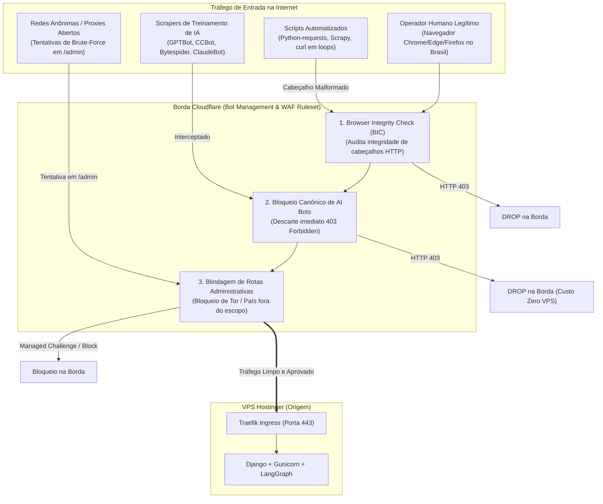

# 🤖 Gerenciamento de Bots, Scrapers & Filtros de Reputação — Cloudflare / SCSI
**Projeto:** Estudo de Arquitetura de Sistemas Inteligentes (Padrão PycoderBR / SCSI)  
**Módulo:** Fase 3 — Borda, Domínio & Criptografia (Passo 3: Cloudflare)  
**Sub-etapa:** 3.2.4 — Bot Management, Bloqueio de AI Scrapers e Filtros Geográficos/Reputação  
**Data de Emissão:** 21/09/2026  
**Status:** **Homologado para Engenharia de Produção**

---

## 1. Propósito do Gerenciamento de Bots em Borda

No ecossistema **SCSI (PycoderBR)**, a plataforma de seguros manipula dados sensíveis de apólices, cotações, contratos e interações analíticas processadas por modelos cognitivos. A proliferação de robôs de inteligência artificial, indexadores comerciais não-autorizados e bibliotecas automatizadas de scraping impõe dois riscos críticos:
1. **Furto de Dados e Propriedade Intelectual:** Raspagem sistemática de dados de cotação de seguros, tabelas de precificação e respostas analíticas dos agentes de IA.
2. **Consumo Parasita de Recursos Computacionais:** Raspadores agressivos que percorrem páginas e acionam requisições consomem largura de banda da VPS Hostinger e ocupam workers do Gunicorn/Django.

O gerenciamento de bots na borda da Cloudflare intercepta essas entidades antes que elas toquem a infraestrutura física da Hostinger.



---

## 2. Browser Integrity Check (BIC)

O **Browser Integrity Check** é uma heurística nativa da Cloudflare que inspeciona o cabeçalho `User-Agent` e a consistência dos headers HTTP enviados pelo cliente:
- Avalia anomalias de conformidade HTTP comuns em ferramentas mal-escritas de spam e scrapers automatizados.
- Se a requisição contiver cabeçalhos incompatíveis com os padrões da IETF/W3C para navegadores modernos, a Cloudflare recusa a conexão imediatamente com resposta **HTTP 403 Forbidden**.
- **Impacto no Backend:** Zero requisições fantasmas chegam ao Gunicorn.

---

## 3. Matriz Canônica de Bloqueio de AI Scrapers e Bots Abusivos

As regras de Bot Management utilizam a sintaxe oficial **Wirefilter (Cloudflare Expression Language)**:

| ID | Nome da Regra | Expressão de Filtro (Wirefilter) | Ação | Justificativa de Engenharia |
| :---: | :--- | :--- | :---: | :--- |
| **01** | **SCSI-BOT-01: Bloqueio de AI Scrapers de Treinamento** | `(http.user_agent contains "GPTBot" or http.user_agent contains "CCBot" or http.user_agent contains "Bytespider" or http.user_agent contains "ClaudeBot" or http.user_agent contains "PerplexityBot" or http.user_agent contains "Amazonbot" or http.user_agent contains "Diffbot" or http.user_agent contains "ImagesiftBot")` | **Block (403)** | Impede a extração não-autorizada de tabelas de seguros, apólices e relatórios analíticos para treinamento de modelos de terceiros. |
| **02** | **SCSI-BOT-02: Bloqueio de Bibliotecas de Raspagem em Rotas SPA/App** | `((http.host eq "app.scsi.pycoder.com.br" or http.request.uri.path starts_with "/app/") and (http.user_agent contains "python-requests" or http.user_agent contains "aiohttp" or http.user_agent contains "Scrapy" or http.user_agent contains "Go-http-client"))` | **Block (403)** | Aplicações SPA autenticadas devem ser acessadas por navegadores reais; scripts de scraping direto são sumariamente descartados. |
| **03** | **SCSI-BOT-03: Blindagem de Reputação e Tor em Painéis Administrativos** | `((http.host eq "traefik.scsi.pycoder.com.br" or http.request.uri.path starts_with "/admin/") and (ip.geoip.is_in_european_union eq false and ip.geoip.country ne "BR" or cf.threat_score gt 20))` | **Managed Challenge** | Desafia conexões com IP de alta pontuação de ameaça ou provenientes de países fora do escopo corporativo tentando acessar o `/admin/` do Django ou o Traefik. |

---

## 4. Arquivo de Governança de Rastreamento: `robots.txt`

Em alinhamento com os bloqueios de borda, o SCSI disponibiliza o contrato padronizado de governança de rastreamento para o frontend e Django:

```text
# SCSI - Sistema de Corretora de Seguros Inteligente (robots.txt)
User-agent: *
Disallow: /admin/
Disallow: /api/
Disallow: /traefik/
Disallow: /app/

# Bloqueio explícito de Bots de Treinamento de IA
User-agent: GPTBot
Disallow: /

User-agent: CCBot
Disallow: /

User-agent: ClaudeBot
Disallow: /

User-agent: Bytespider
Disallow: /

User-agent: PerplexityBot
Disallow: /

User-agent: Amazonbot
Disallow: /
```

---

## 5. Automação Declarativa Headless via Cloudflare API v4 (ADR 011)

Em conformidade com a **ADR 011**, a configuração de proteção contra bots e ativação do BIC é realizada programaticamente pelo Antigravity:

### 5.1. Ativação do Browser Integrity Check (BIC)
- **Endpoint:** `PATCH https://api.cloudflare.com/client/v4/zones/{zone_id}/settings/browser_check`
- **Payload JSON:**
  ```json
  {
    "value": "on"
  }
  ```

### 5.2. Injeção das Regras de Bloqueio no Ruleset Engine
- **Endpoint:** `PUT https://api.cloudflare.com/client/v4/zones/{zone_id}/rulesets/phases/http_request_firewall_custom/entry`
- **Payload Declarativo JSON:**
  ```json
  {
    "rules": [
      {
        "action": "block",
        "expression": "(http.user_agent contains \"GPTBot\" or http.user_agent contains \"CCBot\" or http.user_agent contains \"Bytespider\" or http.user_agent contains \"ClaudeBot\" or http.user_agent contains \"PerplexityBot\" or http.user_agent contains \"Amazonbot\")",
        "description": "SCSI-BOT-01: Bloqueio Canonico de AI Scrapers",
        "enabled": true
      },
      {
        "action": "block",
        "expression": "((http.host eq \"app.scsi.pycoder.com.br\" or http.request.uri.path starts_with \"/app/\") and (http.user_agent contains \"python-requests\" or http.user_agent contains \"aiohttp\" or http.user_agent contains \"Scrapy\"))",
        "description": "SCSI-BOT-02: Bloqueio de Bibliotecas de Raspagem no Frontend",
        "enabled": true
      },
      {
        "action": "managed_challenge",
        "expression": "((http.host eq \"traefik.scsi.pycoder.com.br\" or http.request.uri.path starts_with \"/admin/\") and (ip.geoip.country ne \"BR\" or cf.threat_score gt 20))",
        "description": "SCSI-BOT-03: Desafio Geografico e Reputacional em Rotas Administrativas",
        "enabled": true
      }
    ]
  }
  ```

---

## 6. Parecer de Engenharia da Sub-etapa 3.2.4

- **Engenheiro DevOps:** A combinação do Browser Integrity Check com o bloqueio de scrapers de IA e restrição de User-Agents elimina tráfego abusivo que historicamente infla custos de rede da VPS.
- **Arquiteto de Soluções:** Homologa a abordagem de proteção de dados. A barreira contra bots de IA salvaguarda o diferencial analítico da plataforma de seguros e evita que dados de apólices sejam minerados para enriquecimento de modelos externos.
