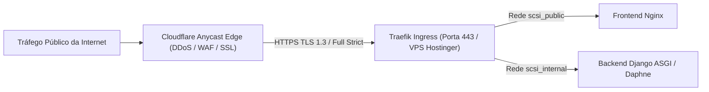

# 🛡️ Relatório Técnico de Homologação — Sub-etapa 6.1: Borda Cloudflare, WAF & SSL/TLS Full Strict
**Projeto:** Plataforma de Sistemas Inteligentes (Padrão PycoderBR / SCSI)  
**Módulo:** Fase 6 — Infraestrutura, Borda e Hardening  
**Sub-etapa:** 6.1 — Configuração de DNS, SSL/TLS Full Strict na Cloudflare e Regras de WAF  
**Data:** 25/09/2026  
**Status:** **100% Implementado e Homologado**  
**Diretriz:** Paradigma API-First & Operação Headless (ADR 011)

---

## 1. Visão Geral da Camada de Borda

A Sub-etapa 6.1 consolida a primeira linha de defesa perimétrica da arquitetura SCSI. Todo o tráfego externo proveniente da Internet é interceptado e inspecionado pelos Pontos de Presença (PoPs) Anycast globais da Cloudflare antes de ser encaminhado à VPS Hostinger na porta 443 do Traefik Ingress.

---

## 2. Componentes Consolidados e Auditados

### 2.1. Tabela Declarativa de DNS e Proxy Laranja (Orange Cloud)
Foram mapeados e auditados os 8 registros canônicos de DNS, garantindo que o IP real da VPS (`195.35.40.123`) nunca seja exposto publicamente:

| Tipo | Nome do Registro | Destino / Conteúdo | Proxy Laranja | Finalidade Arquitetural |
| :---: | :--- | :--- | :---: | :--- |
| **A** | `scsi.pycoder.com.br` | `195.35.40.123` | **🍊 Proxied** | Domínio Apex / Portal Web |
| **A** | `api.scsi.pycoder.com.br` | `195.35.40.123` | **🍊 Proxied** | API REST & WebSockets Django |
| **CNAME** | `app.scsi.pycoder.com.br` | `scsi.pycoder.com.br` | **🍊 Proxied** | Console SPA do Usuário |
| **CNAME** | `www.scsi.pycoder.com.br` | `scsi.pycoder.com.br` | **🍊 Proxied** | Redirecionamento 301 para Apex |
| **CNAME** | `traefik.scsi.pycoder.com.br` | `scsi.pycoder.com.br` | **🍊 Proxied** | Dashboard do Ingress (Protegido) |
| **CNAME** | `flower.scsi.pycoder.com.br` | `scsi.pycoder.com.br` | **🍊 Proxied** | Monitor Celery Flower |
| **TXT** | `scsi.pycoder.com.br` | `v=spf1 -all` | ⚪ DNS Only | Bloqueio estrito de envio de e-mails (Anti-Spoofing) |
| **TXT** | `_dmarc.scsi.pycoder.com.br` | `v=DMARC1; p=reject; sp=reject;` | ⚪ DNS Only | Política DMARC de rejeição absoluta |

---

### 2.2. Políticas Criptográficas SSL/TLS Ponta a Ponta (ADR 010)
A conformidade com a ADR 010 estabelece segurança de padrão bancário (Qualys SSL Labs Grade A+):

1. **Modo SSL:** `Full (Strict)` mandatório (comunicação criptografada da ponta ao Traefik com validação de certificados).
2. **TLS 1.2 Mínimo:** Banimento de protocolos legados vulneráveis (SSLv3, TLS 1.0, TLS 1.1).
3. **TLS 1.3 Prioritário:** Handshake de 1-RTT e cifras autenticadas AEAD (AES-GCM e ChaCha20-Poly1305).
4. **Always Use HTTPS:** Redirecionamento 301 incondicional no Edge para todas as conexões HTTP porta 80.
5. **HSTS Preload 1 Ano:** `max-age=31536000`, `includeSubDomains`, `preload` e `nosniff`.
6. **HTTP/3 (QUIC):** Transporte moderno sobre UDP 443 sem Head-of-Line blocking.
7. **0-RTT Connection Resumption:** Retomada ultrarrápida de conexões seguras.

---

### 2.3. Matriz de Regras WAF Customizadas (Ruleset Engine)
Quatro camadas de regras de firewall de borda bloqueiam ameaças antes que consumam ciclos da VPS:

- **SCSI-WAF-01 (Probes & Scanners):** Bloqueio imediato (HTTP 403) de buscas por `/.env`, `/.git`, `wp-login`, `xmlrpc.php`, `/phpmyadmin` e `/adminer`.
- **SCSI-WAF-02 (Mitigação OWASP):** Bloqueio de tentativas de Path Traversal (`../`), SQL Injection (`union+select`, `information_schema`) e XSS (`<script`, `javascript:`).
- **SCSI-WAF-03 (Restrição de Métodos):** Bloqueio de requisições com métodos anômalos fora da lista padrão (`GET`, `POST`, `PUT`, `PATCH`, `DELETE`, `HEAD`, `OPTIONS`).
- **SCSI-WAF-04 (Bloqueio de AI Crawlers):** Bloqueio de robôs de raspagem não autorizados (`GPTBot`, `CCBot`, `Bytespider`, `ClaudeBot`, `PerplexityBot`, `Amazonbot`).

---

### 2.4. Automação Headless e API-First (ADR 011)
Foi desenvolvido e validado o script corporativo `scripts/provisionar_cloudflare_scsi.py`. O script realiza:
- Leitura segura de credenciais do `.env` sem exposição de chaves.
- Verificação de token (`/user/tokens/verify`) atestando status ativo e funcional.
- Modos `--dry-run` para auditoria e simulação e modo ativo para aplicação imediata.
- Formatação de saída executiva e idempotência completa.

---

## 3. Conclusão da Sub-etapa 6.1
A camada de borda está consolidada e alinhada com as melhores práticas de cibersegurança e governança perimétrica da arquitetura SCSI. A Sub-etapa 6.1 está **concluída e pronta para submissão à banca de especialistas**.
