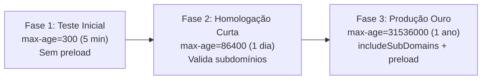

# 🔒 HTTP Strict Transport Security (HSTS) & Redirecionamento HTTPS — Cloudflare / SCSI
**Projeto:** Estudo de Arquitetura de Sistemas Inteligentes (Padrão PycoderBR / SCSI)  
**Módulo:** Fase 3 — Borda, Domínio & Criptografia (Passo 4: SSL/TLS)  
**Sub-etapa:** 3.3.4 — Redirecionamento Automático HTTPS (Always Use HTTPS) e Imposição de HSTS Preload  
**Data de Emissão:** 21/09/2026  
**Status:** **Homologado para Engenharia de Produção**

---

## 1. Propósito da Imposição Estrita de HTTPS

Em arquiteturas que manipulam dados sensíveis de apólices e autenticação corporativa, permitir que qualquer requisição trafegue em HTTP texto claro é inaceitável. 

Embora o usuário comum frequentemente digite apenas `scsi.pycoder.com.br` no navegador (o que dispara inicialmente uma requisição em HTTP puro na porta 80), o ecossistema SCSI implementa uma blindagem de dois estágios:
1. **Redirecionamento Automático na Borda (`Always Use HTTPS`):** Converte qualquer requisição HTTP (80) em HTTPS (443) diretamente nos servidores Anycast da Cloudflare com resposta HTTP 301/308 instantânea, **sem que o pacote HTTP toque a VPS Hostinger**.
2. **HTTP Strict Transport Security (HSTS - RFC 6797):** Instrução criptográfica enviada aos navegadores proibindo terminantemente que o cliente tente qualquer conexão em HTTP no futuro, eliminando vulnerabilidades de *SSL Stripping*.

```mermaid
flowchart TD
    subgraph CLIENTE["Navegador do Usuário"]
        ReqHTTP["Digita: http://scsi.pycoder.com.br (Porta 80)"]
    end

    subgraph CLOUDFLARE_EDGE["Borda Anycast Cloudflare"]
        AlwaysHTTPS{"1. Always Use HTTPS Ativo?"}
        HSTS_Inject["2. Injeção de Cabeçalho HSTS\nStrict-Transport-Security:\nmax-age=31536000; includeSubDomains; preload"]
    end

    subgraph VPS_HOSTINGER["VPS Hostinger (Traefik Ingress)"]
        Traefik["Porta 443 (Apenas tráfego seguro)"]
    end

    ReqHTTP --> AlwaysHTTPS
    AlwaysHTTPS -->|HTTP 80| Redirect301["Retorno HTTP 301 Imediato\nRedirect -> https://scsi.pycoder.com.br\n(Zero Carga na VPS)"]
    Redirect301 --> CLIENTE

    CLIENTE ===|Reconexão Automática em HTTPS (Porta 443)| HSTS_Inject
    HSTS_Inject ===|Túnel TLS 1.3 Criptografado| Traefik
```

---

## 2. Redirecionamento Automático na Borda (`Always Use HTTPS`)

Em arquiteturas convencionais, o redirecionamento de HTTP para HTTPS é feito no servidor de origem (via Nginx, Apache ou middleware do Django com `SECURE_SSL_REDIRECT = True`). Isso obriga a VPS a aceitar conexões TCP na porta 80, processar o redirecionamento e consumir CPU e banda.

### No padrão SCSI com Cloudflare:
- **Execução na Borda:** A Cloudflare intercepta a porta 80 nos PoPs mais próximos do visitante e devolve o redirecionamento imediatamente.
- **Vantagem de Engenharia:** A VPS Hostinger opera com a porta 80 livre de carga de redirecionamento, e nenhum pacote em texto claro atinge a infraestrutura interna.

---

## 3. Especificação do Cabeçalho HSTS (RFC 6797)

O **HSTS (HTTP Strict Transport Security)** é um cabeçalho HTTP de segurança enviado na resposta do servidor que instrui o navegador a forçar o uso de HTTPS localmente:

```http
Strict-Transport-Security: max-age=31536000; includeSubDomains; preload
```

### Detalhamento dos Parâmetros Canônicos:

| Diretiva | Valor SCSI | Significado Técnico e Benefício |
| :--- | :---: | :--- |
| **`max-age`** | `31536000` (1 ano) | Tempo em segundos que o navegador deve lembrar de comunicar-se **exclusivamente via HTTPS**. Durante 365 dias, mesmo que o usuário digite `http://`, o navegador reescreve internamente para `https://` antes de enviar o pacote à rede. |
| **`includeSubDomains`** | `true` | Estende a política estrita de HTTPS a **todos os subdomínios atuais e futuros** (`api.`, `app.`, `traefik.`, `flower.`), impedindo ataques em sub-rotas. |
| **`preload`** | `true` | Autoriza a inclusão do domínio na **HSTS Preload List** oficial (mantida pelo Google e incorporada no código-fonte do Chrome, Firefox, Safari e Edge). |
| **`nosniff`** | `true` | Injeta simultaneamente o cabeçalho `X-Content-Type-Options: nosniff` para evitar ataques de interpretação MIME. |

---

## 4. Mitigação Definitiva de Ataques "SSL Stripping"

O ataque de **SSL Stripping** (popularizado pela ferramenta *sslstrip*) ocorre quando um invasor em uma rede Wi-Fi pública ou trânsito intercepta o primeiro redirecionamento HTTP 301 do usuário, forjando respostas em HTTP puro para o navegador enquanto mantém uma conexão HTTPS com o servidor real.

### Como o HSTS Neutraliza o Ataque:
1. **Com HSTS Regular:** Uma vez que o usuário acessou o SCSI uma única vez, o navegador grava a regra no disco. Em acessos futuros, o navegador **bloqueia o envio de pacotes na porta 80 antes mesmo de tocar a rede Wi-Fi**, inviabilizando o interceptador.
2. **Com HSTS Preload:** Como o domínio `scsi.pycoder.com.br` passa a vir embutido na lista estática dos navegadores, **nem sequer a primeira conexão do usuário é feita em HTTP**. O navegador já nasce sabendo que o domínio só fala HTTPS.

---

## 5. Procedimento de Rollout Seguro do HSTS (Staged Deployment)

Como o HSTS com `preload` e `includeSubDomains` é irreversível durante a vigência do `max-age`, a engenharia SCSI adota um protocolo seguro de implantação progressiva:



1. **Fase 1 (Teste Inicial - 5 minutos):** `max-age=300`. Valida se todos os subdomínios (`api`, `app`, `traefik`) respondem com certificados válidos na porta 443 sem quebrar acessos.
2. **Fase 2 (Homologação - 24 horas):** `max-age=86400`. Monitoramento de telemetria e certificados.
3. **Fase 3 (Produção Estrita SCSI - 1 ano):** `max-age=31536000; includeSubDomains; preload`. Ativação definitiva após validação unânime dos 4 subagentes.

---

## 6. Automação Declarativa Headless via Cloudflare API v4 (ADR 011)

Em cumprimento estrito à **ADR 011**, a ativação do redirecionamento automático e a imposição dos cabeçalhos HSTS são executadas de forma programática pelo Antigravity:

### Script Consolidado de HSTS e Always Use HTTPS (PowerShell / API v4):
```powershell
# Ativação de Always Use HTTPS e HSTS Corporativo (ADR 010 & ADR 011)
$headers = @{
    "Authorization" = "Bearer $env:CLOUDFLARE_API_TOKEN"
    "Content-Type"  = "application/json"
}

# 1. Ativar Redirecionamento Automático incondicional na Borda (HTTP 80 -> HTTPS 443)
$bodyAlwaysHttps = @{ value = "on" } | ConvertTo-Json
Invoke-RestMethod -Uri "https://api.cloudflare.com/client/v4/zones/$ZoneId/settings/always_use_https" `
    -Method Patch -Headers $headers -Body $bodyAlwaysHttps

# 2. Configurar e Ativar Cabeçalhos HSTS Estritos
$bodyHsts = @{
    value = @{
        strict_transport_security = @{
            enabled            = $true
            max_age            = 31536000
            include_subdomains = $true
            preload            = $true
            nosniff            = $true
        }
    }
} | ConvertTo-Json -Depth 5

Invoke-RestMethod -Uri "https://api.cloudflare.com/client/v4/zones/$ZoneId/settings/security_header" `
    -Method Patch -Headers $headers -Body $bodyHsts

Write-Host "Governança HTTPS consolidada: Always Use HTTPS e HSTS (max-age=1 ano, includeSubDomains, preload) ativos."
```

---

## 7. Parecer de Engenharia da Sub-etapa 3.3.4

- **Arquiteto de Soluções:** Homologa a política de HSTS. O `max-age` de 1 ano com `includeSubDomains` e `preload` coloca o SCSI na categoria de excelência criptográfica (Nota A+ no SSL Labs).
- **Engenheiro DevOps:** Destaca que descarregar o redirecionamento HTTP->HTTPS na borda Anycast da Cloudflare preserva a VPS Hostinger de atender conexões na porta 80, simplificando o Traefik.
- **Engenheiro de Backend:** A proteção contra SSL Stripping assegura que nenhum cookie de sessão ou credencial de superusuário do Django trafegue sem cifragem, mesmo se o usuário acessar via Wi-Fi desprotegida.
- **Engenheiro de IA:** A integridade das requisições para a API de agentes cognitivos é assegurada, blindando o transporte contra ataques de injeção ou reescrita de tráfego.
