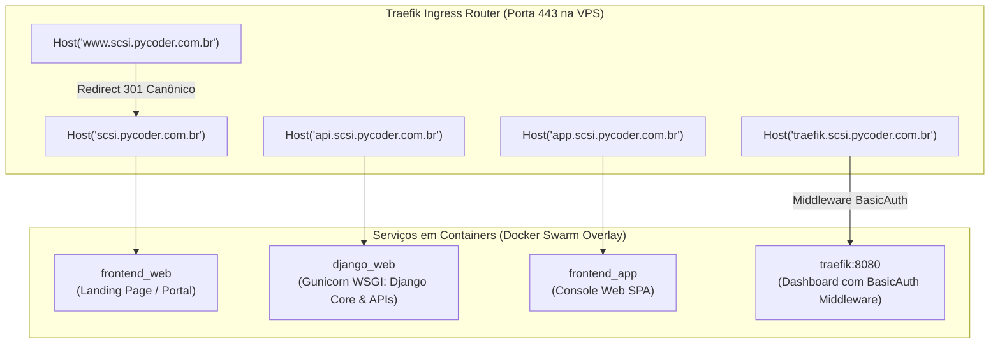

# 📋 Matriz Canônica de Subdomínios & Diretrizes de Ingress (SCSI / PycoderBR)
**Projeto:** Estudo de Arquitetura de Sistemas Inteligentes (Padrão PycoderBR / SCSI)  
**Módulo:** Fase 3 — Borda, Domínio & Criptografia (Passo 3: Cloudflare)  
**Sub-etapa:** 3.1.2 — Elaboração da Matriz Canônica de Subdomínios  
**Data de Emissão:** 21/09/2026  
**Status:** **Homologado para Engenharia de Produção**

---

## 1. Visão Geral e Padronização do Domínio Canônico

Para garantir que a arquitetura corporativa **SCSI (PycoderBR)** mantenha total coerência entre o roteamento de borda (Cloudflare), as regras de proxy reverso dinâmico (Traefik Ingress) e os serviços isolados em contêineres (Docker Swarm), é definida a **Matriz Canônica de Subdomínios**.

O domínio corporativo adotado como referência padrão do estudo é:
- **Domínio Base:** `scsi.pycoder.com.br` *(parametrizável para qualquer domínio registrado de produção)*.

---

## 2. Matriz Canônica de Subdomínios

| Subdomínio / Host | Tipo de Serviço | Destino no Docker Swarm | Regras do Proxy Laranja | Nível de Segurança Perimétrica |
| :--- | :--- | :--- | :---: | :--- |
| **`@` (Apex / Raiz)** | Portal Web / Landing | `frontend_web` (Porta 80) | **Ativo (Proxied)** | WAF Padrão + Cache de Assets + Redirecionamento canônico |
| **`www`** | Alias Canônico | CNAME apontando para `@` | **Ativo (Proxied)** | Redirecionamento 301 automático para o domínio Apex |
| **`api`** | Gateway REST & Agentes | `django_web` (Gunicorn: 8000) | **Ativo (Proxied)** | Rate Limiting rígido + Bypass Cache + WAF OWASP + SSE streaming |
| **`app`** | Console SPA do Usuário | `frontend_app` (Nginx: 80) | **Ativo (Proxied)** | Cache estático imutável + HSTS + Proteção XSS |
| **`traefik`** | Dashboard de Ingress | `traefik` (API Interna: 8080) | **Ativo (Proxied)** | **Segurança Crítica:** BasicAuth (bcrypt) + Whitelist IP / Cloudflare Access |
| **`flower`** *(Fase 7)* | Monitor de Filas Celery | `celery_flower` (Porta 5555) | **Ativo (Proxied)** | **Segurança Crítica:** BasicAuth + Whitelist IP restrita |

---

## 3. Especificação Técnica por Subdomínio



---

### 3.1. Subdomínio Apex (`@` - `scsi.pycoder.com.br`) e `www`
- **Finalidade:** Ponto de entrada institucional, documentação pública e apresentação do sistema.
- **Política de Caching na Cloudflare:**
  - *HTML:* `Cache-Control: public, max-age=300, stale-while-revalidate=60` (5 minutos de cache).
  - *Assets Estáticos (CSS, JS, WebFonts, PNG, SVG):* `Cache-Control: public, max-age=31536000, immutable` (Cache de 1 ano na borda da Cloudflare e no browser).
- **Padronização Canônica:** Implementada regra de redirecionamento 301 de `www.scsi.pycoder.com.br` para `scsi.pycoder.com.br` (evitando duplicidade de SEO e dispersão de cookies de sessão).

---

### 3.2. Subdomínio de API (`api.scsi.pycoder.com.br`)
- **Finalidade:** Gateway central de comunicação entre frontends, aplicações mobile, integrações de terceiros e endpoints de IA.
- **Serviço de Destino:** Contêiner `django_web` servido por workers Gunicorn em rede overlay interna.
- **Políticas Específicas de Borda:**
  - **Bypass de Cache Obrigatório:** Requisições para a API **nunca** devem ser armazenadas em cache na borda (`Cache-Control: no-store, no-cache, must-revalidate`).
  - **Suporte a Streaming de IA (SSE):** O Ingress e a borda devem manter conexões persistentes para Server-Sent Events (SSE) ao transmitir tokens gerados por LLMs em tempo real.
  - **CORS Estrito:** Headers `Access-Control-Allow-Origin` restritos explicitamente aos subdomínios autorizados (`https://app.scsi.pycoder.com.br` e `https://scsi.pycoder.com.br`).

---

### 3.3. Subdomínio da Aplicação (`app.scsi.pycoder.com.br`)
- **Finalidade:** Console autenticado do usuário para interações com agentes cognitivos, relatórios analíticos e parametrizações operacionais.
- **Arquitetura:** Single Page Application (SPA).
- **Políticas de Borda:**
  - `index.html`: Sempre servido com `no-cache` para garantir que o cliente baixe imediatamente novos deploys.
  - Chunks compilados (JS/CSS): Servidos com hash imutável e cache máximo na CDN da Cloudflare.

---

### 3.4. Subdomínio Administrativo do Ingress (`traefik.scsi.pycoder.com.br`)
- **Finalidade:** Visualização da telemetria do cluster, roteadores ativos, middleware em execução e healthcheck dos contêineres Docker Swarm.
- **Vulnerabilidade Associada:** Expor a telemetria interna sem proteção perimétrica permitiria a invasores mapear todos os microsserviços do backend.
- **Camadas de Blindagem Obrigatórias:**
  1. **Autenticação em Dois Níveis:**
     - Nível 1: Cloudflare WAF / Cloudflare Access (Zero Trust) bloqueando o acesso de qualquer IP que não esteja na whitelist de administradores.
     - Nível 2: Traefik Middleware `traefik-auth` utilizando `BasicAuth` com hashes bcrypt salgados gerados via `htpasswd`.
  2. **Bloqueio de Indexação:** Injeção do header de borda `X-Robots-Tag: noindex, nofollow, noarchive` para impedir que motores de busca cataloguem o painel.

---

## 4. Diretrizes de Labels para o Docker Swarm (Fase 5)

Cada serviço nos arquivos `docker-compose.yml` da arquitetura declarará seus rótulos (*labels*) correspondentes aos subdomínios mapeados:

```yaml
# Exemplo Canônico de Labels para o Serviço Django (api.scsi.pycoder.com.br)
services:
  django_web:
    deploy:
      labels:
        - "traefik.enable=true"
        - "traefik.http.routers.django-api.rule=Host(`api.scsi.pycoder.com.br`)"
        - "traefik.http.routers.django-api.entrypoints=websecure"
        - "traefik.http.routers.django-api.tls=true"
        - "traefik.http.services.django-api.loadbalancer.server.port=8000"
        - "traefik.docker.network=frontend-net"
```

---

## 5. Parecer de Engenharia da Sub-etapa 3.1.2

- **Engenheiro DevOps:** Matriz clara, com separação de domínios por contexto de negócio e tipo de tráfego. Garante roteamento determinístico no Traefik e facilita a criação de regras no WAF.
- **Arquiteto de Soluções:** Homologa o padrão de isolamento entre API (`api.`), Console (`app.`) e Gestão de Tráfego (`traefik.`). A política de redirecionamento canônico de `www` garante integridade de sessões.
