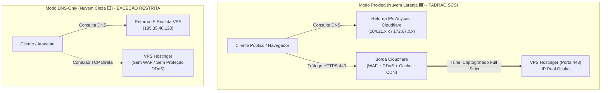

# 🛡️ Políticas Operacionais do Proxy Laranja: Proxied vs DNS-Only (Cloudflare / SCSI)
**Projeto:** Estudo de Arquitetura de Sistemas Inteligentes (Padrão PycoderBR / SCSI)  
**Módulo:** Fase 3 — Borda, Domínio & Criptografia (Passo 3: Cloudflare)  
**Sub-etapa:** 3.1.4 — Políticas Operacionais do Proxy Laranja  
**Data de Emissão:** 21/09/2026  
**Status:** **Homologado para Engenharia de Produção**

---

## 1. Visão Geral: Nuvem Laranja (Proxied) vs Nuvem Cinza (DNS-Only)

Na gestão de zonas autoritativas da Cloudflare, cada registro DNS de roteamento (A, AAAA, CNAME) possui um seletor operacional fundamental: **Proxy Status**.

### Comparativo Técnico Operacional:

| Recurso / Propriedade | Modo Proxied (Nuvem Laranja 🟧) | Modo DNS-Only (Nuvem Cinza ⬜) |
| :--- | :---: | :---: |
| **Resolução de IP no DNS** | Endereço Anycast da Cloudflare | Endereço IP Real da VPS Hostinger |
| **Ocultação da Origem (IP Real)** | **Totalmente Protegido e Invisível** | **Exposto Publicamente** |
| **Firewall de Borda (WAF)** | Ativo (Regras OWASP, SQLi, XSS) | Inativo (Sem inspeção L7) |
| **Mitigação DDoS (L3/L4/L7)** | Absorção automática em 300+ PoPs | Tráfego atinge a placa de rede da VPS |
| **Aceleração e Cache CDN** | Ativo (Cache estático, HTTP/3, QUIC) | Inativo (Sem cache) |
| **Protocolos Suportados** | Apenas HTTP, HTTPS e WebSockets | Qualquer protocolo TCP/UDP |
| **Uso no Ecossistema SCSI** | **Obrigatório para todos os subdomínios web** | **Restrito a registros de texto (TXT/SPF)** |

---

## 2. Matriz de Portas Compatíveis com o Proxy da Cloudflare

A rede da Cloudflare atua como um reverse proxy HTTP/HTTPS nas seguintes portas padrão:

- **Portas HTTP suportadas:** `80`, `8080`, `8880`, `2052`, `2082`, `2086`, `2095`
- **Portas HTTPS suportadas:** `443`, `2053`, `2083`, `2087`, `2096`, `8443`

### Diretriz Arquitetural SCSI:
O ecossistema SCSI padroniza **exclusivamente as portas canônicas 80 (apenas para redirecionamento 301) e 443 (HTTPS criptografado)**. Nenhuma porta alternativa (ex: 8080 ou 8443) é exposta externamente na borda, mantendo a superfície de ataque mínima e uniforme.

---

## 3. O Dilema do SSH (Porta 22) & Neutralização do Vazamento de IP

### O Problema do "Origin IP Leakage":
Um erro comum de engenharia é criar um registro DNS como `ssh.scsi.pycoder.com.br` apontando para a VPS com a nuvem cinza (`DNS-Only`), para permitir conexões `ssh user@ssh.scsi...`.  
**Impacto de Segurança:** Uma simples consulta `nslookup ssh.scsi.pycoder.com.br` revelará o IP real da VPS Hostinger para qualquer atacante no mundo. O atacante poderá então direcionar ataques DDoS e scans de vulnerabilidades diretamente contra o IP da VPS, contornando a Cloudflare por completo (*Direct Origin Bypass*).

### Solução Arquitetural SCSI (3 Níveis de Blindagem):

1. **Regra de Ouro de DNS:** **NUNCA** criar registros DNS públicos (A ou CNAME) para o protocolo SSH.
2. **Acesso Padrão Direto (Nível 1):**
   - O administrador conecta-se via SSH utilizando diretamente o IP fornecido pela Hostinger no inventário de infraestrutura (guardado de forma privada no cofre de senhas/SSH config local do desenvolvedor), sem amarrá-lo a um hostname público.
   - O acesso SSH é blindado na Fase 4 com porta alterada, autenticação exclusiva por chaves assimétricas **Ed25519**, desativação de login por senha e **Fail2ban**.
3. **Acesso Corporativo Zero Trust (Nível 2 - Padrão Ouro):**
   - Implementação de um túnel seguro via **Cloudflare Tunnel (`cloudflared`)**.
   - O daemon `cloudflared` roda na VPS e estabelece uma conexão *outbound* (de dentro da VPS para a Cloudflare).
   - O acesso SSH é realizado através do navegador ou terminal autenticado com Single Sign-On (SSO / 2FA) via Cloudflare Access, permitindo **fechar a porta 22 completamente no firewall externo**.

---

## 4. Suporte Nativo a WebSockets (`wss://`)

O ecossistema SCSI integra agentes de Inteligência Artificial e consoles em tempo real (Passos 10, 13 e 15).

- **Comportamento do Proxy Laranja:** A Cloudflare suporta conexões WebSockets nativamente em todos os planos sem custo adicional.
- **Transição de Protocolo:**
  1. O cliente inicia uma conexão HTTP com o cabeçalho `Upgrade: websocket` e `Connection: Upgrade`.
  2. A borda da Cloudflare valida a requisição, aplica as regras do WAF e estabelece o túnel TCP persistente bidirecional (`wss://app.scsi.pycoder.com.br/ws/chat/`).
  3. O Traefik repassa a conexão para o contêiner de backend mantendo o canal aberto.
- **Configuração no Painel:** A opção *WebSockets* permanece permanentemente ativada na aba *Network* da Cloudflare.

---

## 5. Checklist de Prevenção contra Vazamento de IP (Anti-Leakage)

Para assegurar que o IP real da VPS permaneça inviolável:

- [x] **Subdomínios Web:** 100% configurados com Nuvem Laranja (`proxied: true`).
- [x] **Sem Hostname para SSH:** Proibida a criação de `ssh.dominio.com.br` em modo DNS-Only.
- [x] **Sem Servidor de E-mail Local:** A VPS não hospeda serviço de correio SMTP na porta 25 (e-mails são disparados via API REST transacional de terceiros como Resend/SendGrid com TLS, sem registros MX apontando para a VPS).
- [x] **Bloqueio de Headers de Vazamento:** O Traefik e o Gunicorn são configurados para não retornar o IP interno nos cabeçalhos de resposta (`Server: Cloudflare` mascarado na borda).

---

## 6. Parecer de Engenharia da Sub-etapa 3.1.4

- **Engenheiro DevOps:** A diretriz de não criar subdomínios DNS-Only para SSH é vital. Evita que o esforço de colocar a Cloudflare seja anulado por uma consulta pública no Shodan ou SecurityTrails.
- **Arquiteto de Soluções:** Homologa as políticas de isolamento de tráfego e suporte a WebSockets para a camada de IA.
