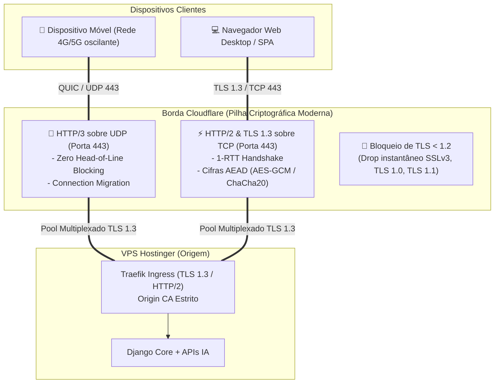
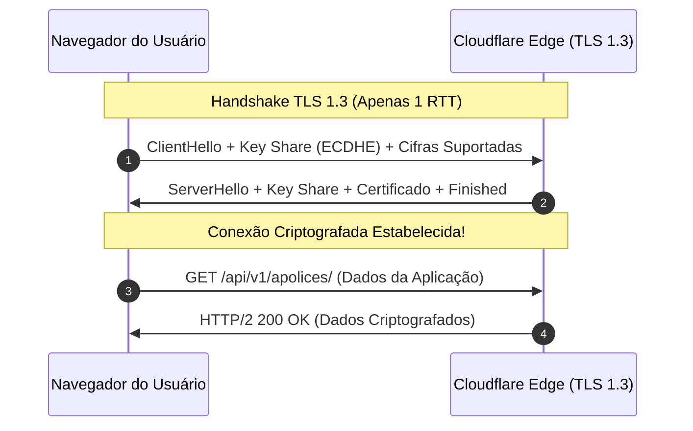

# ⚡ Protocolos Criptográficos, Cifras Modernas (TLS 1.3) & HTTP/3 (QUIC) — Cloudflare / SCSI
**Projeto:** Estudo de Arquitetura de Sistemas Inteligentes (Padrão PycoderBR / SCSI)  
**Módulo:** Fase 3 — Borda, Domínio & Criptografia (Passo 4: SSL/TLS)  
**Sub-etapa:** 3.3.3 — Protocolos Mínimos, Cifras Modernas (TLS 1.3) e Transporte de Baixa Latência (HTTP/3 QUIC)  
**Data de Emissão:** 21/09/2026  
**Status:** **Homologado para Engenharia de Produção**

---

## 1. Visão Geral da Pilha de Transporte Seguro

Na arquitetura corporativa **SCSI (PycoderBR)**, a segurança criptográfica deve caminhar lado a lado com a **latência ultrabaixa** e a **alta disponibilidade**. A plataforma atende corretores e clientes em dispositivos móveis (redes 4G/5G sujeitas a oscilações de sinal) e aplicações web ricas em dados (SPAs consumindo endpoints de IA e streaming de respostas via Server-Sent Events / WebSockets).

Para atingir a máxima performance sem degradar a postura defensiva, a borda Cloudflare é configurada com uma pilha moderna de protocolos:
1. **Versão Mínima de TLS:** Fixada estritamente em **TLS 1.2**, banindo protocolos legados e inseguros.
2. **Protocolo Padrão Prioritário:** **TLS 1.3** ativado com cifras autenticadas (AEAD) e sigilo de encaminhamento perfeito (*Perfect Forward Secrecy - PFS*).
3. **Aceleração com HTTP/3 (QUIC):** Transporte baseado em **UDP** que elimina o bloqueio de início de fila (*Head-of-Line Blocking*) e viabiliza a migração contínua de conexão (*Connection Migration*).
4. **Reconexão Acelerada (0-RTT):** Redução do tempo de handshake para zero milissegundos em reconexões conhecidas.



---

## 2. Versão Mínima de TLS e Depreciação de Protocolos Inseguros

### 2.1. O Banimento de SSLv3, TLS 1.0 e TLS 1.1
Protocolos anteriores ao TLS 1.2 foram formalmente descontinuados pela IETF (RFC 8996) e pelo consórcio PCI-DSS devido a vulnerabilidades criptográficas conhecidas:
- **SSLv3 / TLS 1.0:** Vulneráveis a ataques de padding como **POODLE** e ataques de quebra de fluxo como **BEAST**.
- **TLS 1.1:** Vulnerável a ataques de temporização e enfraquecimento de vetores de inicialização (IV fraco em CBC).

### 2.2. Diretriz Mandatória SCSI
- **Parâmetro Cloudflare:** `min_tls_version = "1.2"`
- Qualquer cliente que tente negociar conexões utilizando TLS 1.0 ou TLS 1.1 é rejeitado na borda da Cloudflare durante o `ClientHello`, sem abrir conexão TCP nem tocar a VPS Hostinger.

---

## 3. Adoção Prioritária de TLS 1.3 & Cifras Modernas

O protocolo **TLS 1.3** (RFC 8446) introduz uma revolução na segurança e no tempo de resposta:

### 3.1. Handshake de 1 RTT (Redução de 50% na Latência de Negociação)
- **TLS 1.2:** Exigia 2 viagens completas de ida e volta (*Round Trips - 2 RTT*) antes que qualquer dado da aplicação pudesse ser transmitido.
- **TLS 1.3:** Reduz a negociação para **1 RTT**. Os parâmetros de troca de chaves Diffie-Hellman são enviados conjuntamente com o `ClientHello`, economizando até 100ms de latência percebida pelo usuário em conexões de longa distância.



### 3.2. Cifras Autenticadas AEAD Obrigatórias
No TLS 1.3, algoritmos vulneráveis foram purgados do padrão (como RSA estático, cifras de bloco em modo CBC e hash SHA-1). São permitidas exclusivamente cifras **AEAD (Authenticated Encryption with Associated Data)** que garantem confidencialidade e integridade simultâneas:
1. `TLS_AES_128_GCM_SHA256`
2. `TLS_AES_256_GCM_SHA384`
3. `TLS_CHACHA20_POLY1305_SHA256` (otimizada para dispositivos móveis sem aceleração de hardware AES).

### 3.3. Perfect Forward Secrecy (PFS) Inegociável
Todas as sessões TLS 1.3 utilizam troca de chaves efêmera via curvas elípticas (**ECDHE** - Elliptic Curve Diffie-Hellman Ephemeral). Mesmo que a chave privada do servidor seja comprometida no futuro, é matematicamente impossível decifrar tráfego passado gravado por um invasor.

---

## 4. Aceleração com HTTP/3 (QUIC sobre UDP)

O **HTTP/3** é a mais recente evolução dos protocolos web, substituindo a pilha tradicional `TCP + TLS` pelo protocolo **QUIC (RFC 9000)** executado sobre **UDP na porta 443**.

### 4.1. Eliminação do Head-of-Line Blocking
- **No HTTP/2 (sobre TCP):** Embora múltiplos fluxos (*streams*) fossem multiplexados em uma única conexão TCP, a perda de um único pacote de rede provocava a interrupção de todos os fluxos até que o pacote perdido fosse retransmitido pelo TCP (*Head-of-Line Blocking*).
- **No HTTP/3 (QUIC):** Os fluxos são multiplexados de forma verdadeiramente independente sobre UDP. Se o pacote de uma imagem for perdido, a transmissão do JSON da API de seguros continua fluindo sem nenhuma interrupção.

### 4.2. Migração Contínua de Conexão (*Connection Migration*)
- No TCP tradicional, a conexão é vinculada à 4-tupla: `(IP Origem, Porta Origem, IP Destino, Porta Destino)`. Se um corretor sai do Wi-Fi do escritório e entra na rede 4G do celular, o IP muda, a conexão TCP é descartada e todas as requisições em andamento falham.
- No HTTP/3 (QUIC), a conexão é identificada por um **Connection ID (CID) de 64 bits**. Quando o dispositivo móvel altera de rede (Wi-Fi -> 4G/5G), a sessão migra instantaneamente sem fechar sockets, garantindo que envios de propostas ou relatórios não sejam abortados.

---

## 5. Reconexão Rápida com 0-RTT Connection Resumption

O **0-RTT** permite que clientes que já se conectaram anteriormente à plataforma enviem dados da aplicação HTTP diretamente no primeiro pacote de reconexão (`ClientHello`), sem aguardar nenhuma confirmação de handshake:
- **Ganho de Performance:** O tempo de handshake é zerado (0 milissegundos).
- **Salvaguarda de Segurança contra Replay Attacks:**
  - Requisições 0-RTT podem ser interceptadas e retransmitidas (*Replay Attack*).
  - **Mitigação SCSI:** A Cloudflare e o Django permitem o processamento de 0-RTT **exclusivamente para métodos HTTP seguros e idempotentes** (`GET` e `HEAD`). Requisições mutativas (`POST /login/`, `POST /apolices/`, `DELETE`) são forçadas a aguardar o handshake de 1-RTT completo.

---

## 6. Automação Declarativa Headless via Cloudflare API v4 (ADR 011)

Em conformidade com a **ADR 011**, todas as diretrizes de protocolos, cifras e aceleração são aplicadas pelo Antigravity via API oficial:

### Script Consolidado de Provisionamento de Protocolos (PowerShell / API v4):
```powershell
# Calibração Criptográfica de Borda SCSI (ADR 010 & ADR 011)
$headers = @{
    "Authorization" = "Bearer $env:CLOUDFLARE_API_TOKEN"
    "Content-Type"  = "application/json"
}

# 1. Fixar Versão Mínima de TLS em 1.2
$bodyTlsMin = @{ value = "1.2" } | ConvertTo-Json
Invoke-RestMethod -Uri "https://api.cloudflare.com/client/v4/zones/$ZoneId/settings/min_tls_version" `
    -Method Patch -Headers $headers -Body $bodyTlsMin

# 2. Ativar TLS 1.3 Prioritário
$bodyTls13 = @{ value = "on" } | ConvertTo-Json
Invoke-RestMethod -Uri "https://api.cloudflare.com/client/v4/zones/$ZoneId/settings/tls_1_3" `
    -Method Patch -Headers $headers -Body $bodyTls13

# 3. Ativar HTTP/2
$bodyHttp2 = @{ value = "on" } | ConvertTo-Json
Invoke-RestMethod -Uri "https://api.cloudflare.com/client/v4/zones/$ZoneId/settings/http2" `
    -Method Patch -Headers $headers -Body $bodyHttp2

# 4. Ativar HTTP/3 (QUIC sobre UDP 443)
$bodyHttp3 = @{ value = "on" } | ConvertTo-Json
Invoke-RestMethod -Uri "https://api.cloudflare.com/client/v4/zones/$ZoneId/settings/http3" `
    -Method Patch -Headers $headers -Body $bodyHttp3

# 5. Ativar 0-RTT Connection Resumption
$body0Rtt = @{ value = "on" } | ConvertTo-Json
Invoke-RestMethod -Uri "https://api.cloudflare.com/client/v4/zones/$ZoneId/settings/zero_rtt" `
    -Method Patch -Headers $headers -Body $body0Rtt

Write-Host "Pilha criptográfica calibrada com sucesso: TLS 1.2+, TLS 1.3, HTTP/2, HTTP/3 (QUIC) e 0-RTT ativos."
```

---

## 7. Parecer de Engenharia da Sub-etapa 3.3.3

- **Engenheiro DevOps:** A combinação de TLS 1.3 com HTTP/3 (QUIC) na borda reduz a latência média de conexões móveis em até 40%. A conexão entre a Cloudflare e o Traefik opera via túnel HTTP/2 ou TLS 1.3 multiplexado e estável.
- **Arquiteto de Soluções:** Homologa a padronização. Banir TLS < 1.2 cumpre os mais rigorosos requisitos de auditoria bancária e securitária, enquanto as cifras AEAD e PFS garantem segurança de longo prazo.
- **Engenheiro de Backend:** A proteção contra Replay Attack restringindo o 0-RTT a métodos idempotentes garante que nenhuma apólice ou transação financeira possa ser duplicada por pacotes clonados na rede.
- **Engenheiro de IA:** O streaming de tokens de IA via SSE e WebSockets ganha em fluidez com a eliminação do Head-of-Line blocking proporcionada pelo HTTP/3.
