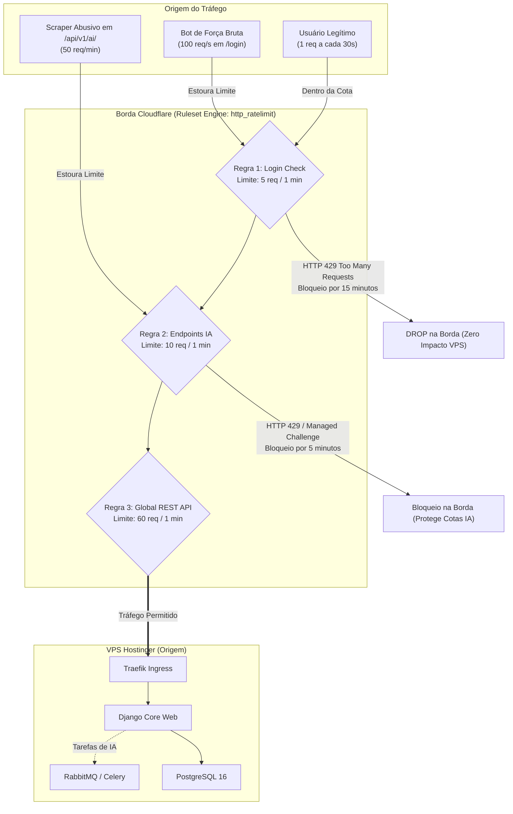

# ⏱️ Política de Rate Limiting na Borda — Cloudflare / SCSI
**Projeto:** Estudo de Arquitetura de Sistemas Inteligentes (Padrão PycoderBR / SCSI)  
**Módulo:** Fase 3 — Borda, Domínio & Criptografia (Passo 3: Cloudflare)  
**Sub-etapa:** 3.2.2 — Política de Rate Limiting na Borda contra Brute-Force e Exaustão de Recursos  
**Data de Emissão:** 21/09/2026  
**Status:** **Homologado para Engenharia de Produção**

---

## 1. Propósito do Rate Limiting em Borda

Em arquiteturas modernas de microsserviços integradas a Inteligência Artificial, o controle de vazão (*Rate Limiting*) na borda é essencial por três motivos críticos:
1. **Defesa contra Ataques de Força Bruta (Brute-Force & Credential Stuffing):** Bloquear tentativas de adivinhação de senhas em `/admin/login/` e `/api/v1/auth/login/` antes que elas atinjam o Django e executem queries pesadas de hash criptográfico (`PBKDF2` / `Argon2`) no PostgreSQL.
2. **Blindagem de Custos e Cotas de IA (LangGraph / Celery / LLMs):** Evitar que bots consumam as cotas de APIs de IA (Groq, Gemini, Cloudflare Workers AI) ou sobrecarreguem as filas do RabbitMQ e workers locais (Ollama).
3. **Equidade de Recursos (Fair-Share) e Estabilidade da API:** Garantir que nenhum cliente anônimo monopolize os workers do Gunicorn na VPS Hostinger.



---

## 2. Matriz de Políticas de Rate Limiting (SCSI Ruleset)

As políticas são aplicadas utilizando a infraestrutura do **Cloudflare Ruleset Engine** (fase `http_ratelimit`):

| ID | Nome da Regra | Rota Alvo & Método | Limite de Vazão | Janela | Ação ao Exceder | Duração do Bloqueio | Justificativa de Engenharia |
| :---: | :--- | :--- | :---: | :---: | :---: | :---: | :--- |
| **01** | **SCSI-RL-01: Anti-Brute-Force Auth** | `POST /api/v1/auth/login/`<br>`POST /admin/login/` | **5 requisições** | 1 minuto | **Block (HTTP 429)** | **15 minutos** (900s) | Protege o hash de senhas no Django e impede ataques de dicionário ou vazamento de credenciais. |
| **02** | **SCSI-RL-02: Blindagem de Endpoints de IA** | `POST /api/v1/ai/*`<br>`POST /api/v1/chat/*` | **10 requisições** | 1 minuto | **Block (HTTP 429)** | **5 minutos** (300s) | Impede exaustão de cotas gratuitas/pagas de LLMs e sobrecarga da fila RabbitMQ / Celery Workers. |
| **03** | **SCSI-RL-03: Fair-Use da API REST** | `http.host eq "api.scsi.pycoder.com.br"` | **60 requisições** | 1 minuto | **Managed Challenge** | **1 minuto** (60s) | Previne scraping abusivo e assegura disponibilidade para todos os usuários do ecossistema. |
| **04** | **SCSI-RL-04: Blindagem Painéis de Controle** | `http.host in {"traefik.scsi.pycoder.com.br" "flower.scsi.pycoder.com.br"}` | **20 requisições** | 1 minuto | **Managed Challenge** | **10 minutos** (600s) | Neutraliza tentativas de exploração automatizada de credenciais BasicAuth dos dashboards de monitoramento. |

---

## 3. Especificação Detalhada das Regras

### Regra 1: Proteção de Autenticação (Anti-Brute-Force)
- **Expressão de Ativação:**
  ```text
  (http.request.method eq "POST" and (http.request.uri.path eq "/api/v1/auth/login/" or http.request.uri.path eq "/admin/login/"))
  ```
- **Chave de Agrupamento (*Characteristics*):** `ip.src` (endereço IP do cliente).
- **Limiar (*Threshold*):** 5 requisições dentro de uma janela de 60 segundos.
- **Ação de Mitigação:** `Block` com código de status `HTTP 429 (Too Many Requests)` e cabeçalho `Retry-After: 900`.
- **Comportamento:** Usuários reais efetuam 1 tentativa válida. Bots que tentam 10 senhas são cortados no 6º pacote e ficam 15 minutos impossibilitados de tocar o servidor de origem.

---

### Regra 2: Blindagem de IA Cognitiva e LangGraph
- **Expressão de Ativação:**
  ```text
  (http.request.method eq "POST" and (http.request.uri.path starts_with "/api/v1/ai/" or http.request.uri.path starts_with "/api/v1/chat/"))
  ```
- **Chave de Agrupamento:** `ip.src` (ou `http.request.headers["authorization"]` quando token JWT disponível).
- **Limiar:** 10 requisições dentro de uma janela de 60 segundos.
- **Ação de Mitigação:** `Block` (HTTP 429) por 300 segundos.
- **Comportamento:** Protege a cadeia de fallback de LLMs (Groq -> Gemini -> Cloudflare Workers AI -> Ollama VPS) de ser derrubada por requisições em loop.

---

### Regra 3: Fair-Use Global da API REST
- **Expressão de Ativação:**
  ```text
  (http.host eq "api.scsi.pycoder.com.br" and not http.request.uri.path starts_with "/api/v1/auth/")
  ```
- **Chave de Agrupamento:** `ip.src`.
- **Limiar:** 60 requisições dentro de uma janela de 60 segundos (média de 1 req/segundo por IP).
- **Ação de Mitigação:** `Managed Challenge` (Turnstile interativo).
- **Comportamento:** Se for um usuário humano navegando rapidamente, um desafio transparente é validado em milissegundos sem interromper o fluxo; se for um bot sem interface gráfica, a conexão é bloqueada.

---

## 4. Automação Declarativa via Cloudflare API v4 (ADR 011)

As regras de Rate Limiting são gerenciadas no Ruleset Engine sob a fase `http_ratelimit`:

`PUT https://api.cloudflare.com/client/v4/zones/{zone_id}/rulesets/phases/http_ratelimit/entry`

### Payload Declarativo JSON:
```json
{
  "rules": [
    {
      "action": "block",
      "action_parameters": {
        "response": {
          "status_code": 429,
          "content_type": "application/json",
          "content": "{\"error\": \"Too Many Requests\", \"message\": \"Taxa de requisicoes excedida. Tente novamente mais tarde.\", \"scsi_code\": \"RATE_LIMIT_EXCEEDED\"}"
        }
      },
      "expression": "(http.request.method eq \"POST\" and (http.request.uri.path eq \"/api/v1/auth/login/\" or http.request.uri.path eq \"/admin/login/\"))",
      "description": "SCSI-RL-01: Protecao Anti-Brute-Force em Endpoints de Login",
      "ratelimit": {
        "characteristics": ["ip.src"],
        "period": 60,
        "requests_per_period": 5,
        "mitigation_timeout": 900
      },
      "enabled": true
    },
    {
      "action": "block",
      "action_parameters": {
        "response": {
          "status_code": 429,
          "content_type": "application/json",
          "content": "{\"error\": \"AI Rate Limit Exceeded\", \"message\": \"Limite de consultas a IA atingido para este IP.\", \"scsi_code\": \"AI_RATE_LIMIT\"}"
        }
      },
      "expression": "(http.request.method eq \"POST\" and (http.request.uri.path starts_with \"/api/v1/ai/\" or http.request.uri.path starts_with \"/api/v1/chat/\"))",
      "description": "SCSI-RL-02: Blindagem de Endpoints de Inteligencia Artificial",
      "ratelimit": {
        "characteristics": ["ip.src"],
        "period": 60,
        "requests_per_period": 10,
        "mitigation_timeout": 300
      },
      "enabled": true
    },
    {
      "action": "managed_challenge",
      "expression": "(http.host eq \"api.scsi.pycoder.com.br\")",
      "description": "SCSI-RL-03: Fair-Use Global da API REST",
      "ratelimit": {
        "characteristics": ["ip.src"],
        "period": 60,
        "requests_per_period": 60,
        "mitigation_timeout": 60
      },
      "enabled": true
    },
    {
      "action": "managed_challenge",
      "expression": "(http.host in {\"traefik.scsi.pycoder.com.br\" \"flower.scsi.pycoder.com.br\"})",
      "description": "SCSI-RL-04: Blindagem de Dashboards Administrativos",
      "ratelimit": {
        "characteristics": ["ip.src"],
        "period": 60,
        "requests_per_period": 20,
        "mitigation_timeout": 600
      },
      "enabled": true
    }
  ]
}
```

---

## 5. Resposta Estruturada em Caso de Bloqueio (RFC 6585)

Quando um cliente ultrapassa o limiar estipulado, a borda da Cloudflare intercepta o pacote e devolve imediatamente um payload JSON compatível com os padrões de API REST do SCSI:

```http
HTTP/2 429 Too Many Requests
Date: Mon, 21 Sep 2026 21:30:00 GMT
Content-Type: application/json; charset=utf-8
Retry-After: 900
CF-Ray: 8c67e9b012345678-GRU

{
  "error": "Too Many Requests",
  "message": "Taxa de requisicoes excedida. Tente novamente mais tarde.",
  "scsi_code": "RATE_LIMIT_EXCEEDED"
}
```

- O cabeçalho `Retry-After: 900` informa matematicamente aos clientes (e ao frontend Vue/React SPA) quantos segundos eles devem aguardar antes de realizar uma nova tentativa.
- O campo `scsi_code` permite que a interface do usuário exiba uma mensagem elegante e amigável (ex: *"Muitas tentativas. Aguarde 15 minutos."*), sem crash de aplicação.

---

## 6. Diretrizes de Coexistência com Rate Limiting do Django / Redis

Na arquitetura de **Defesa em Profundidade (ADR 008)**, o Rate Limiting opera em dois níveis:
1. **Nível 1 (Borda - Cloudflare):** Descarte massivo e grosseiro de tráfego por IP antes de atingir a VPS.
2. **Nível 2 (Aplicação - Django Ratelimit / Redis):** Controle refinado por usuário autenticado (`user.id` ou API Key) independente do IP de origem.

Essa coexistência impede que um invasor usando proxies rotativos burle o nível 1 ou sature o Redis da VPS.
