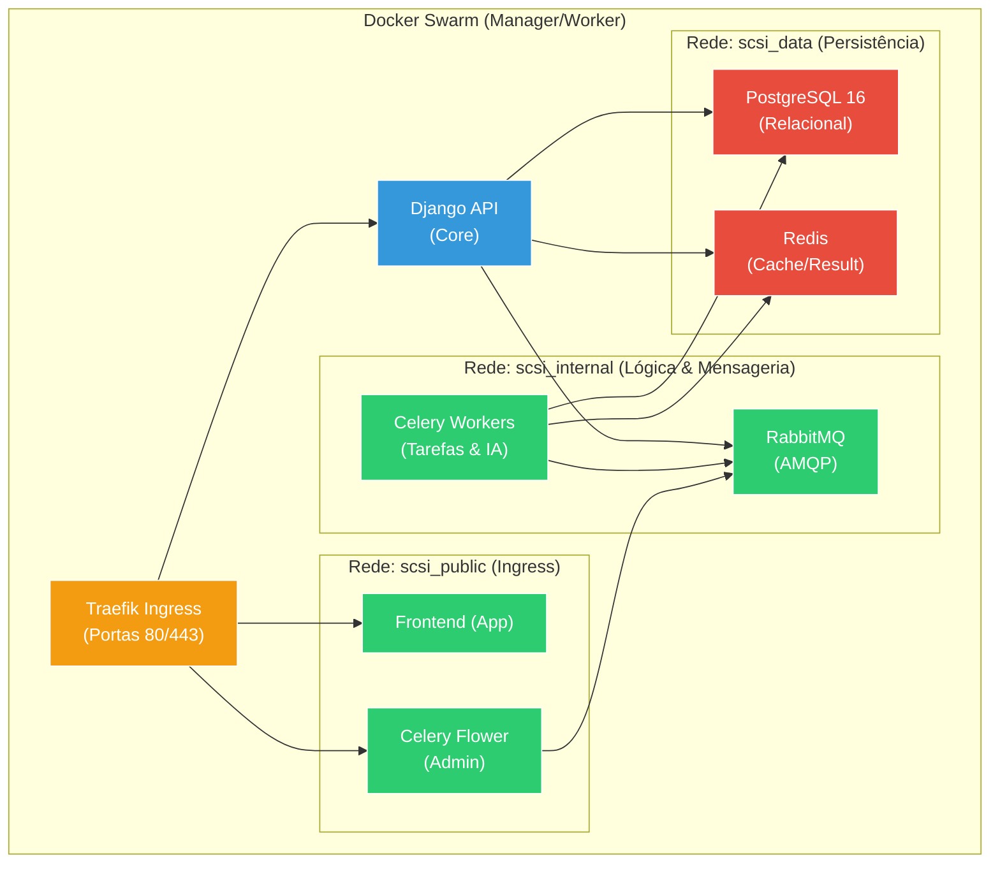

# 🕸️ Especificação de Topologia de Redes Overlay (Micro-segmentação) — SCSI
**Projeto:** Estudo de Arquitetura de Sistemas Inteligentes (Padrão PycoderBR / SCSI)  
**Módulo:** Fase 5 — Orquestração de Containers (Docker Swarm)  
**Sub-etapa:** 5.1 — Topologia de Redes Overlay e Isolamento  
**Data de Emissão:** 24/09/2026  

---

## 1. Princípio de Isolamento (Zero Trust Interno)

No Docker Swarm, redes do tipo `overlay` permitem que containers em servidores físicos diferentes se comuniquem como se estivessem no mesmo switch local. 

O anti-padrão mais comum é anexar todos os serviços a uma única rede global. Na arquitetura SCSI, adotamos a **Micro-segmentação**: um serviço só é anexado à rede estritamente necessária para o seu funcionamento. 

**Regra de Ouro:** O Traefik (porta de entrada pública) **jamais** terá interface de rede compartilhada com o PostgreSQL ou Redis. Se o Ingress for comprometido, o atacante não terá rota de rede para os bancos de dados.

---

## 2. Diagrama de Topologia de Redes



---

## 3. Especificação das Redes Overlay

A infraestrutura é dividida em três domínios de broadcast (redes) isolados:

### 3.1. `scsi_public` (Zona de Ingress)
- **Propósito:** Roteamento do tráfego externo (via Traefik) para as aplicações de borda.
- **Serviços Conectados:** Traefik, Django (API), Frontend (SPA), Celery Flower.
- **Risco:** Alto (recebe payloads HTTP brutos da internet).

### 3.2. `scsi_internal` (Zona Assíncrona / Mensageria)
- **Propósito:** Comunicação de backend, orquestração de filas (AMQP) e RPCs internos.
- **Serviços Conectados:** Django (API), Celery Workers (IA e Tarefas), RabbitMQ, Celery Flower.
- **Risco:** Baixo (Totalmente isolado do Traefik e da internet).

### 3.3. `scsi_data` (Zona de Persistência)
- **Propósito:** Tráfego pesado de I/O de disco e memória (Consultas SQL, Sessões, Cache).
- **Serviços Conectados:** Django (API), Celery Workers, PostgreSQL, Redis.
- **Risco:** Crítico (Guarda os dados do negócio e vetores de IA). Completamente blindado contra componentes frontais.

---

## 4. Provisionamento Declarativo (CLI)

Para evitar dependência de ordem de *deploy* nos arquivos `docker-compose`, as redes *overlay* principais devem ser provisionadas manualmente (ou via script de automação) como redes externas **antes** da subida das *stacks*.

> ⚠️ **Atenção DevOps (Trade-off de Criptografia IPSec):** 
> A flag `--opt encrypted` força o uso de IPSec nativo no plano de dados do Swarm. Isso garante que todo tráfego (ex: consultas SQL) transite criptografado entre nós físicos. **No entanto**, isso causa overhead de CPU e reduz o *throughput* de rede severamente.
> - Se os seus nós Swarm se comunicam pela **Internet Pública**: MANTENHA a flag `--opt encrypted` (Criptografia obrigatória).
> - Se os seus nós estão na mesma **Rede Privada (VPC/LAN)** do Datacenter: REMOVA a flag `--opt encrypted` para maximizar a performance, pois o ambiente físico já provê o isolamento necessário.

```bash
# Provisionamento das Redes SCSI (Exemplo COM criptografia ativada)
docker network create --driver overlay --attachable --opt encrypted scsi_public
docker network create --driver overlay --attachable --opt encrypted scsi_internal
docker network create --driver overlay --attachable --opt encrypted scsi_data
```

Nos arquivos `docker-compose.yml`, elas serão referenciadas como externas:
```yaml
networks:
  scsi_public:
    external: true
```
