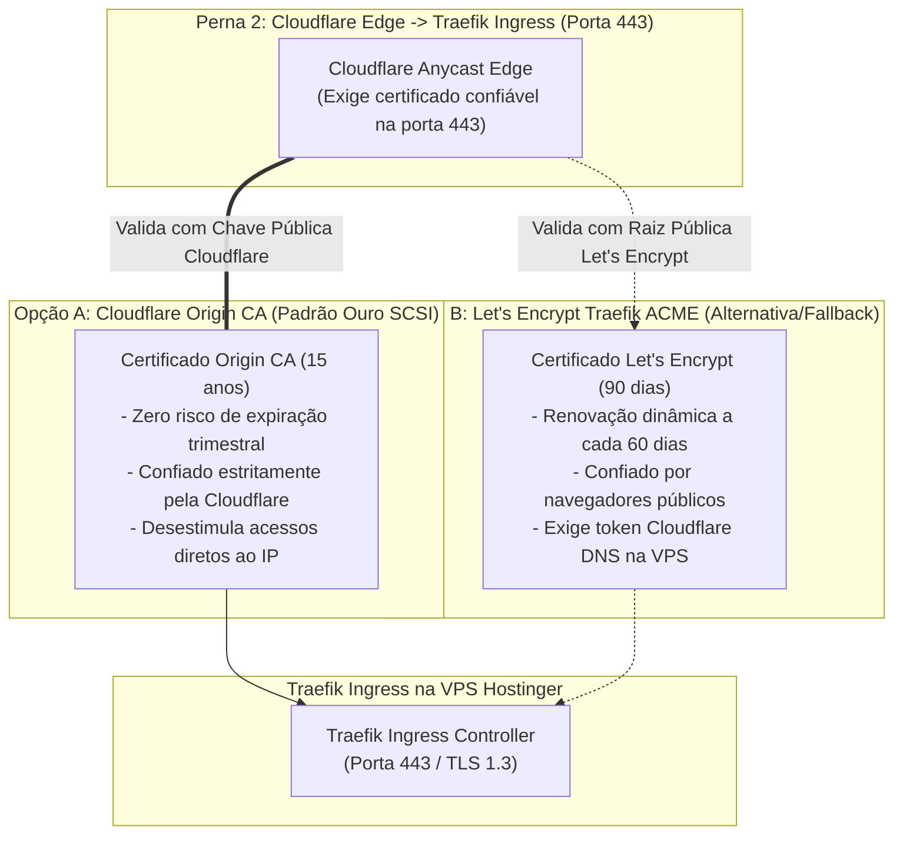

# 📜 Avaliação de Trade-offs: Cloudflare Origin CA vs Traefik ACME (Let's Encrypt)
**Projeto:** Estudo de Arquitetura de Sistemas Inteligentes (Padrão PycoderBR / SCSI)  
**Módulo:** Fase 3 — Borda, Domínio & Criptografia (Passo 4: SSL/TLS)  
**Sub-etapa:** 3.4.1 — Avaliação de Trade-offs de Emissão de Certificados na Origem (VPS Hostinger)  
**Data de Emissão:** 21/09/2026  
**Status:** **Homologado para Engenharia de Produção**

---

## 1. O Desafio da Criptografia na Origem (Perna 2)

Para satisfazer a **ADR 010 (Obrigatoriedade do Modo SSL/TLS Full Strict)**, a porta 443 do Traefik Ingress na VPS Hostinger deve responder obrigatoriamente com um certificado SSL/TLS válido e confiável para o domínio `scsi.pycoder.com.br` e seus subdomínios coringas (`*.scsi.pycoder.com.br`).

Existem duas abordagens consolidadas na engenharia de software para resolver esse requisito:
1. **Opção A:** Certificado emitido pela **Cloudflare Origin CA** com validade de longo prazo (até 15 anos).
2. **Opção B:** Certificado emitido pelo **Let's Encrypt via Traefik ACME** com renovação dinâmica trimestral via desafio DNS-01.



---

## 2. Análise Aprofundada da Opção A: Cloudflare Origin CA

A **Cloudflare Origin CA** é uma autoridade certificadora própria mantida pela Cloudflare, desenhada exclusivamente para gerar certificados instalados nos servidores de origem (VPS).

### Características e Benefícios:
1. **Validade de Longo Prazo (Até 15 Anos):** O certificado é emitido uma única vez com validade de 15 anos. Elimina para sempre o risco operacional mais frequente em infraestruturas web: **queda de produção devido a falhas em renovações automáticas trimestrais de certificados**.
2. **Confiado Exclusivamente pela Cloudflare:** A raiz da Origin CA é embutida nos nós da Cloudflare. A borda valida o certificado com 100% de precisão sob o modo `Full (Strict)`.
3. **Blindagem contra Bypass de IP (Direct Origin Access):** Como a raiz da Origin CA não vem embutida nos navegadores de desktop (Chrome/Edge/Firefox), qualquer invasor que descubra o IP real da VPS Hostinger e tente acessá-lo diretamente via navegador receberá um alerta vermelho de certificado não confiável (`NET::ERR_CERT_AUTHORITY_INVALID`), neutralizando acessos fora da borda.
4. **Zero Dependência de Portas Abertas:** Não exige porta 80 aberta para validação HTTP-01 e não depende de tokens de edição de DNS rodando dentro da VPS.

---

## 3. Análise Aprofundada da Opção B: Let's Encrypt via Traefik ACME (DNS-01)

O **Let's Encrypt** é uma autoridade certificadora pública e gratuita globalmente reconhecida por todos os navegadores.

### Como Funciona no Traefik com Cloudflare:
- O Traefik utiliza seu módulo nativo de ACME (*Automatic Certificate Management Environment*) para resolver o desafio **DNS-01**:
  1. O Traefik conecta-se à API da Cloudflare utilizando um token de DNS.
  2. Cria temporariamente um registro TXT `_acme-challenge.scsi.pycoder.com.br`.
  3. O Let's Encrypt valida o registro TXT e emite o certificado com validade de 90 dias.
  4. O Traefik armazena o certificado no arquivo `acme.json` e renova automaticamente a cada 60 dias.

### Desafios e Riscos Operacionais:
1. **Risco de Rate Limit:** O Let's Encrypt impõe limites severos (máximo de 5 emissões duplicadas por semana e 50 por domínio registrado). Se a VPS reiniciar frequentemente durante testes ou o arquivo `acme.json` for corrompido, o domínio é bloqueado por 7 dias.
2. **Exposição de Credenciais na VPS:** Obriga a armazenar na VPS Hostinger um token com permissão de escrita de DNS (`Zone:DNS:Edit`), aumentando a superfície de risco caso o servidor seja comprometido.
3. **Fadiga de Renovação:** 4 renovações obrigatórias por ano aumentam a probabilidade de incidentes por indisponibilidade transitória das APIs.

---

## 4. Matriz Comparativa de Engenharia

| Dimensão Técnica | Opção A: Cloudflare Origin CA | Opção B: Let's Encrypt ACME | Veredito SCSI |
| :--- | :---: | :---: | :--- |
| **Validade do Certificado** | **Até 15 anos** | 90 dias (renovação a cada 60 dias) | 🏆 **Origin CA:** Estabilidade absoluta. |
| **Risco de Queda por Expiração** | **Virtualmente Zero** | Moderado (depende do cron ACME) | 🏆 **Origin CA:** Elimina falhas de renovação. |
| **Risco de Rate Limit** | **Nenhum** | Alto (limite de 5 certificados/semana) | 🏆 **Origin CA:** Imunidade a bloqueios. |
| **Permissões de API na VPS** | **Zero tokens de escrita na VPS** | Exige token com permissão `Zone:DNS:Edit` | 🏆 **Origin CA:** Princípio do Menor Privilégio. |
| **Proteção contra Acesso Direto** | **Alta** (alerta de certificado inválido) | Baixa (o navegador aceitaria o IP direto) | 🏆 **Origin CA:** Dificulta bypass da borda. |
| **Acesso se o Proxy Laranja Cair** | Requer reativar o proxy ou trocar cert | Acesso direto ao IP funciona com cadeado | ⚠️ **Let's Encrypt** (única vantagem pontual). |

---

## 5. Decisão Arquitetural SCSI

Em consenso entre os 4 subagentes especialistas:

### 🏆 Padrão Primário Oficial: Cloudflare Origin CA (Validade de 15 Anos)
- A VPS Hostinger utilizará o certificado **Cloudflare Origin CA** instalado estaticamente no Traefik Ingress.
- **Justificativa:** Garantir **risco zero de parada operacional por expiração de SSL**, eliminar a necessidade de manter tokens com privilégios de DNS dentro da VPS e reforçar a barreira contra invasores tentando acessar o IP direto do servidor.

### 🛡️ Padrão de Contingência Documentado: Traefik ACME (DNS-01)
- Mantido como alternativa documentada caso a arquitetura exija, em cenários futuros de migração, operação sem o proxy da Cloudflare.

---

## 6. Automação Declarativa Headless via Cloudflare API v4 (ADR 011)

A emissão do certificado Origin CA pode ser solicitada e gerenciada diretamente pelo Antigravity através da API v4:

### 6.1. Endpoint de Emissão de Certificados de Origem
`POST https://api.cloudflare.com/client/v4/certificates`

### 6.2. Payload Declarativo JSON (Geração com Chave Privada na Cloudflare):
```json
{
  "hostnames": [
    "scsi.pycoder.com.br",
    "*.scsi.pycoder.com.br"
  ],
  "requested_validity": 5475,
  "request_type": "origin-rsa"
}
```
*(Nota: `5475` dias = 15 anos de validade ininterrupta).*

### 6.3. Script PowerShell Headless para Emissão e Armazenamento:
```powershell
# Emissão automatizada de certificado Origin CA via API (ADR 011)
$headers = @{
    "Authorization" = "Bearer $env:CLOUDFLARE_API_TOKEN"
    "Content-Type"  = "application/json"
}

$body = @{
    hostnames          = @("scsi.pycoder.com.br", "*.scsi.pycoder.com.br")
    requested_validity = 5475
    request_type       = "origin-rsa"
} | ConvertTo-Json

$response = Invoke-RestMethod -Uri "https://api.cloudflare.com/client/v4/certificates" `
    -Method Post -Headers $headers -Body $body

# O retorno contém o certificado público ($response.result.certificate)
# e a chave privada ($response.result.private_key) prontos para o Traefik.
Write-Host "Certificado Origin CA emitido com sucesso! Validade até: $($response.result.expires_on)"
```

---

## 7. Parecer de Engenharia da Sub-etapa 3.4.1

- **Engenheiro DevOps:** A escolha do Cloudflare Origin CA simplifica drasticamente a configuração do `traefik.yml`. Em vez de configurar resolvedores ACME complexos, gerenciar arquivos de lock e se preocupar com tokens de DNS dentro do container, basta montar o par de arquivos `.crt` e `.key` como segredos do Docker Swarm.
- **Arquiteto de Soluções:** Homologa a escolha. A estabilidade de 15 anos aliada à proteção natural contra bypass do proxy reverso converge exatamente com a filosofia corporativa de alta resiliência e baixa manutenção do SCSI.
- **Engenheiro de Backend:** Ressalta a tranquilidade de não sofrer com interrupções súbitas de comunicação em APIs e WebSockets causadas por eventuais renovações falhas do Let's Encrypt.
- **Engenheiro de IA:** A estabilidade dos túneis seguros garante que os agentes cognitivos operem sem perda transitória de conectividade.
